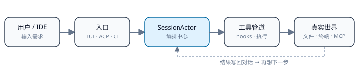
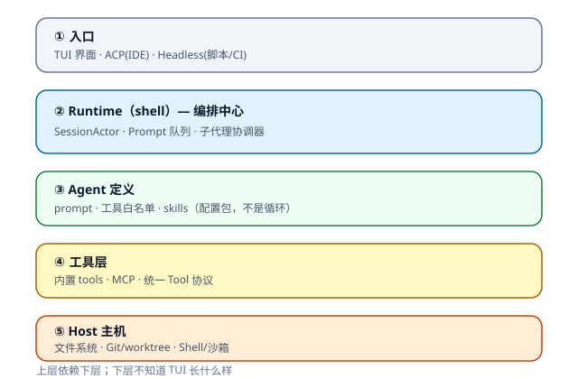
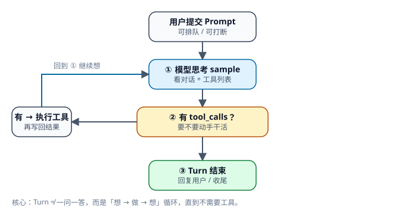
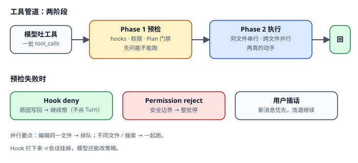
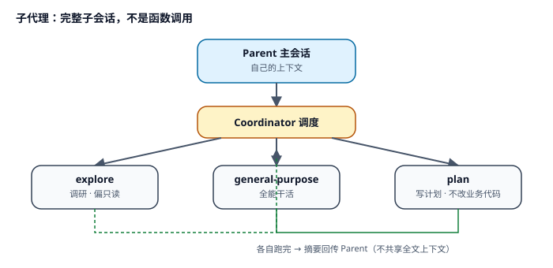
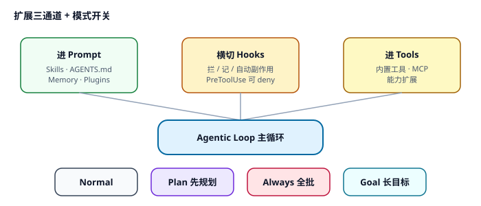
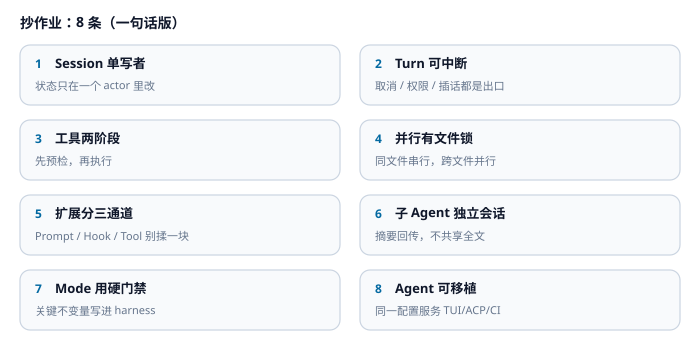

# Doggy 编排

> 用**真图片**讲清 Agent 怎么被调度。  
> 打开本文件预览即可看图（不依赖 Mermaid 插件）。

---

## 目录

| 章节 | 一句话 | 详情 |
|------|--------|------|
| [0. 坐标系](#0-坐标系) | 一切经 SessionActor | — |
| [1. 分层](#1-分层) | UI 与编排分离 | [详情](编排/分层.md) |
| [2. 主循环](#2-主循环) | 想 → 做 → 想 | [详情](编排/主循环.md) |
| [3. 工具管道](#3-工具管道) | 先预检，再执行 | [详情](编排/工具管道.md) |
| [4. 子代理](#4-子代理) | 子会话 + 摘要回传 | [详情](编排/子代理.md) |
| [5. 扩展面](#5-扩展面) | Prompt / Hook / Tool | [详情](编排/扩展面.md) |
| [6. 经验](#6-经验) | 可抄的 8 条 | [详情](编排/经验.md) |
| [7. 完成权](#7-完成权-doggy) | Round ≠ Task；只有审计通过才 Done | [详情](编排/完成权.md) |
| [8. 阅读路径](#8-阅读路径) | 文档 + 源码入口 | — |

---

## 0. 坐标系



**记住三句：**

1. **SessionActor 是编排中心** —— prompt、工具、子代理都经它。  
2. **Agent 是配置，不是循环** —— 循环在 shell，配置在 agent builder。  
3. **Turn 是「想→做→想」** —— 不是一问一答。

---

## 1. 分层



| 层 | 职责 | 深入 |
|----|------|------|
| 入口 | 展示 / IDE / 脚本 | [详情](编排/分层.md) |
| Runtime | 会话 actor、队列、子代理 | 同上 |
| Agent | prompt + 工具白名单 | 同上 |
| Tools | 内置 + MCP | 同上 |
| Host | 文件 / Git / 终端 | 同上 |

官方：[Agent Mode](../crates/codegen/xai-grok-pager/docs/user-guide/15-agent-mode.md) · 源码：[shell/session](../crates/codegen/xai-grok-shell/src/session/) · [agent README](../crates/codegen/xai-grok-agent/README.md)

---

## 2. 主循环



**Turn 出口：** 正常完成 · 权限拒绝 · 用户取消 · max_turns · 插话后续跑。

→ [主循环详情](编排/主循环.md)  
源码：[`turn.rs`](../crates/codegen/xai-grok-shell/src/session/acp_session_impl/turn.rs) · [`run_loop.rs`](../crates/codegen/xai-grok-shell/src/session/acp_session_impl/run_loop.rs)

---

## 3. 工具管道



| 策略 | 行为 |
|------|------|
| Hook deny | **不杀 turn**，原因喂回模型 |
| Permission reject | 整批停 |
| 同文件编辑 | 串行 |
| 跨文件 | 并行 |

→ [工具管道详情](编排/工具管道.md)  
官方：[Hooks](../crates/codegen/xai-grok-pager/docs/user-guide/10-hooks.md) · [Permissions](../crates/codegen/xai-grok-pager/docs/user-guide/22-permissions-and-safety.md)

---

## 4. 子代理



| 概念 | 是什么 |
|------|--------|
| **Agent** | 整会话：模型、工具、prompt |
| **Persona** | 叠在 subagent 上的行为补丁 |
| **隔离** | 独立上下文；可选 worktree |

→ [子代理详情](编排/子代理.md)  
官方：[Subagents](../crates/codegen/xai-grok-pager/docs/user-guide/16-subagents.md)

---

## 5. 扩展面



| 通道 | 作用 | 官方 |
|------|------|------|
| Skills | 可复用流程 | [08](../crates/codegen/xai-grok-pager/docs/user-guide/08-skills.md) |
| Hooks | 拦 / 记 / 副作用 | [10](../crates/codegen/xai-grok-pager/docs/user-guide/10-hooks.md) |
| MCP | 外部工具 | [07](../crates/codegen/xai-grok-pager/docs/user-guide/07-mcp-servers.md) |
| Plan | 先规划再写码 | [19](../crates/codegen/xai-grok-pager/docs/user-guide/19-plan-mode.md) |

→ [扩展面详情](编排/扩展面.md)

---

## 6. 经验



→ [经验 + 自检清单](编排/经验.md)

---

## 7. 完成权（Doggy）

**Round 结束 ≠ Task 结束。** 完成权只属于 `TaskOrchestrator`：有 open items 就续跑；清空后必须过审计；审不过继续改；**只有审计通过才 Done**。

→ [完成权详情](编排/完成权.md)  
源码：[`xai-doggy-orchestrator`](../crates/codegen/xai-doggy-orchestrator/)（shell 重导出为 `session::orchestrator`）

---

## 8. 阅读路径

| 你想… | 先读 | 再读源码 |
|-------|------|----------|
| 整体 | 本文 §0–§1 | 仓库 `README` 布局 |
| 循环 | [主循环](编排/主循环.md) | `turn.rs` → `handle_prompt` |
| **完成权** | [完成权](编排/完成权.md) | `session/orchestrator/` |
| 工具 | [工具管道](编排/工具管道.md) | `tool_calls.rs` |
| 多 Agent | [子代理](编排/子代理.md) | `subagent_coordinator.rs` |
| 扩展 | [扩展面](编排/扩展面.md) | user-guide 07–10、19 |

### 源码热区

```text
xai-grok-shell
  xai-doggy-orchestrator/        ← Doggy 完成权（Phase A，纯策略）
  session/acp_session_impl/run_loop.rs
  session/acp_session_impl/turn.rs
  session/acp_session_impl/tool_calls.rs
  session/acp_session_impl/tool_dispatch.rs
  agent/mvp_agent/subagent_coordinator.rs

xai-grok-agent / xai-grok-tools / xai-tool-runtime / xai-grok-workspace
```

官方总目录：[user-guide](../crates/codegen/xai-grok-pager/docs/user-guide/README.md)

---

### 看图说明

- 图片在 `docs/编排/images/*.svg`，任何 Markdown 预览都能显示。  
- 若预览仍空白：用 Cursor/VS Code 打开 **预览**（`Ctrl+Shift+V`），或直接点开 svg 文件。  
- 以前 Mermaid「闪一下没了」是扩展渲染失败，现已改成真图。
